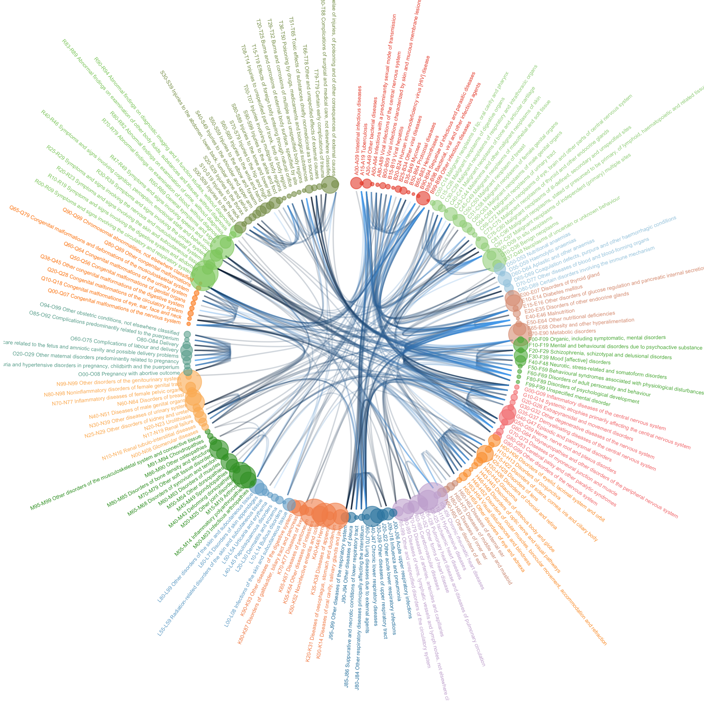

```{r echo=FALSE}
# Just to add space between the introduction of the document
knitr::asis_output(htmltools::htmlPreserve("<br><br>"))
```


This document summarizes my work concerning comorbidity in the UKB. It is composed by several parts:

* **Data Wrangling**: Get the data from the UKB, calculate disease occurence + pairs of disease occurence + comorbidity index, download heritabilities from Neale's Lab, load ICD10 classification.
* **UKB general description**: a general explorative analysis on the UKB. How many people? Their main characteristics? Main diseases observed? Where are they?
* **Comorbidity**: Analyse the occurence of each pair of disease, compute comorbidity index, visualize it.


```{r echo=FALSE}
# Just to add space between the introduction of the document
knitr::asis_output(htmltools::htmlPreserve("<br><br>"))
```


