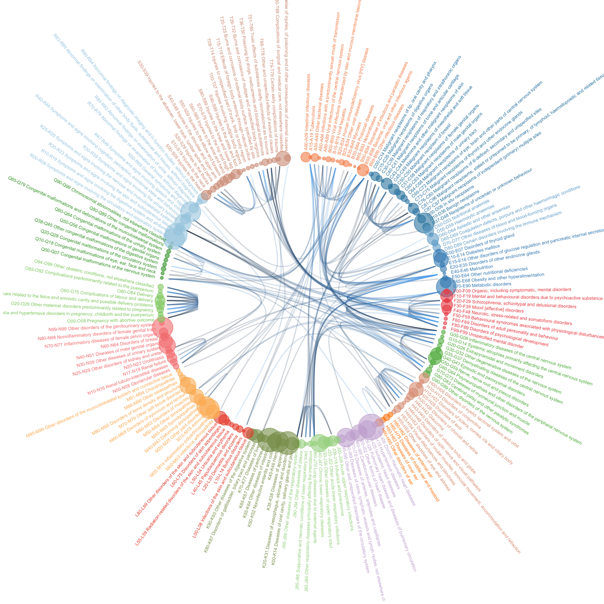

Exploring Comorbidity in the UKB
===================

[See project online](https://holtzy.github.io/UKB-Comorbidity/index.html)

Overview
--------

The UK Biobank is a huge dataset giving information on the health of about 500 000 people, including their genetic information. This repository explores the comorbidity in this dataset. It is organised in several parts: 

- **Data Wrangling**: Get the data from the UKB, calculate disease occurence + pairs of disease occurence + comorbidity index, download heritabilities from Neale’s Lab, load ICD10 classification.
- **UKB general description**: a general explorative analysis on the UKB. How many people? Their main characteristics? Main diseases observed? Where are they?
- **Comorbidity**: Analyse the occurence of each pair of disease, compute comorbidity index, visualize it.
- **Genetic correlation**: Compute the genetic correlation for each pair of 600 diseases and describe it
- **Link Como - GC**: Is comorbidity controled by genetic or not?

See this analysis as a website [here](https://holtzy.github.io/UKB-Comorbidity/index.html).

Here is an overview of the links between diseases:

